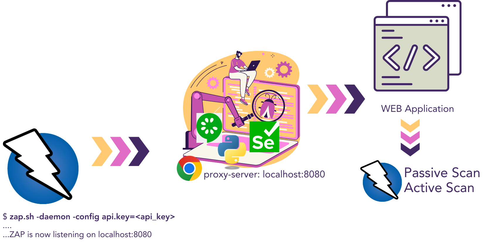

The aim of this project is to develop a PoC of an integration of the following elements:
- Web testing
- ZAProxy

First of all, an e-commerce web site has been generated using Claude.ai: 
- Follow [this instructions](docs/website.md) to lauch the e-commerce.

Then a full test enviroment has been created to define, execute and analyze our integration:
- Follow [this instructions](docs/test.md) to enjoy testing!

